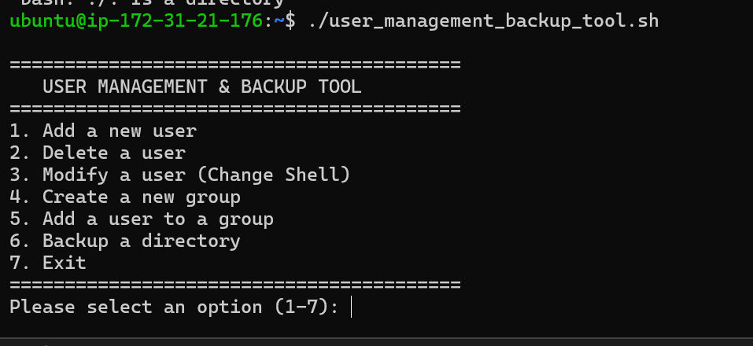

# User Management and Backup Tool

A simple and interactive **Bash scripting project** designed to automate basic Linux system administration tasks, including user management, group management, and directory backups.

This project provides a menu-driven interface that allows administrators or students to perform common system administration operations directly from the terminal.

---

## 📌 Features

The **User Management and Backup Tool** provides the following functionalities:

- 👤 Add a new user
- 🗑️ Delete an existing user
- 🔧 Modify a user's default shell
- 👥 Create a new group
- ➕ Add a user to a group
- 💾 Backup a directory into a ZIP file
- 🚪 Exit the application safely

---

## 🛠️ Technologies Used

- **Bash Scripting**
- **Linux User Management Commands**
- `useradd`
- `userdel`
- `usermod`
- `groupadd`
- `passwd`
- `zip`

---

## 📂 Project Structure

```text
user-management-backup-tool/
│
├── user_management_backup.sh
└── README.md
🚀 Getting Started
1. Clone the Repository
git clone https://github.com/YOUR-USERNAME/user-management-backup-tool.git
2. Navigate to the Project Directory
cd user-management-backup-tool
3. Give Execute Permission
chmod +x user_management_backup.sh
4. Run the Script
./user_management_backup.sh

Note: Some operations require administrator privileges. The script uses sudo for commands that modify users and groups.

📋 Main Menu

When the script is executed, the following menu is displayed:

=========================================
   USER MANAGEMENT & BACKUP TOOL
=========================================
1. Add a new user
2. Delete a user
3. Modify a user (Change Shell)
4. Create a new group
5. Add a user to a group
6. Backup a directory
7. Exit
=========================================
📸 Screenshot: Main Menu
<!-- ADD SCREENSHOT HERE -->

📌 What screenshot should be added here?

Take a screenshot after running the script and showing the complete main menu in the terminal.

Example:

./user_management_backup.sh

The screenshot should clearly show all options from 1 to 7.

👤 1. Add a New User

This option allows the administrator to create a new Linux user.

The script:

Asks for a username.
Checks whether the user already exists.
Creates a home directory using useradd -m.
Prompts the administrator to set a password.
Example
Enter the new username: john
New password:
Retype new password:
Success: User 'john' has been added.
📸 Screenshot: Adding a User
<!-- ADD SCREENSHOT HERE -->

📌 What screenshot should be added here?

Take a screenshot showing:

Selecting option 1
Entering a username
Setting the password
The success message

For example:

Please select an option (1-7): 1

Enter the new username: testuser

Success: User 'testuser' has been added.
🗑️ 2. Delete a User

This option removes an existing Linux user.

The command:

sudo userdel -r username

The -r option removes both:

The user account
The user's home directory
Example
Enter the username to delete: john
Success: User 'john' and their home directory have been deleted.
📸 Screenshot: Deleting a User
<!-- ADD SCREENSHOT HERE -->

📌 What screenshot should be added here?

Take a screenshot showing:

Selecting option 2
Entering an existing username
Successful deletion message
🔧 3. Modify a User Shell

This feature allows the administrator to change the default shell of an existing user.

For example:

Enter the username to modify: john
Enter the new shell path: /bin/bash
Success: User 'john' shell changed to /bin/bash.

The script uses:

sudo usermod -s /bin/bash username
📸 Screenshot: Changing User Shell
<!-- ADD SCREENSHOT HERE -->

📌 What screenshot should be added here?

Take a screenshot showing:

Selecting option 3
Entering the username
Entering a shell path such as /bin/bash
The success message
👥 4. Create a New Group

This option allows the administrator to create a new Linux group.

The script first checks whether the group already exists.

Example
Enter the new group name: developers
Success: Group 'developers' has been created.

The command used is:

sudo groupadd developers
📸 Screenshot: Creating a Group
<!-- ADD SCREENSHOT HERE -->

📌 What screenshot should be added here?

Take a screenshot showing:

Selecting option 4
Entering a group name
The success message

Example:

Enter the new group name: developers
Success: Group 'developers' has been created.
➕ 5. Add a User to a Group

This feature allows an existing user to be added to an existing group.

The script verifies that both the user and group exist before performing the operation.

Example
Enter the username: john
Enter the group name: developers

Success: User 'john' added to group 'developers'.

The command used is:

sudo usermod -aG developers john
📸 Screenshot: Adding User to a Group
<!-- ADD SCREENSHOT HERE -->

📌 What screenshot should be added here?

Take a screenshot showing:

Selecting option 5
Entering the username
Entering the group name
The successful confirmation message
💾 6. Backup a Directory

This feature creates a ZIP backup of a selected directory.

The user provides the absolute path of the directory.

The backup filename automatically includes:

Directory name
Backup date
Backup time
Example
Enter the absolute path of the directory to backup:

/home/user/Documents

The generated backup file will look similar to:

Documents_backup_2026-08-27-10-30.zip

The script uses:

zip -r backup_file.zip directory_name
📸 Screenshot: Directory Backup
<!-- ADD SCREENSHOT HERE -->

📌 What screenshot should be added here?

Take a screenshot showing:

Selecting option 6
Entering a valid directory path
The backup process
The generated ZIP file name

For a more professional result, you can also take another screenshot showing the generated .zip file using:

ls
🚪 7. Exit

Selecting option 7 safely exits the program.

Example
Please select an option (1-7): 7

Exiting the script. Have a great day!
📸 Screenshot: Exiting the Program
<!-- ADD SCREENSHOT HERE -->

📌 What screenshot should be added here?

Take a screenshot showing:

Selecting option 7
The exit message
⚠️ Error Handling

The script includes basic validation and error handling.

User Already Exists
Error: User 'john' already exists.
User Does Not Exist
Error: User 'john' does not exist.
Group Already Exists
Error: Group 'developers' already exists.
Invalid Directory
Error: Directory '/invalid/path' does not exist.
Invalid Menu Option
Invalid option. Please select a number between 1 and 7.
📸 Screenshot: Error Handling
<!-- ADD SCREENSHOT HERE -->

📌 Recommended screenshot:

Take one screenshot demonstrating an error, such as:

Adding an existing user
Deleting a non-existing user
Entering an invalid menu option
Providing an invalid directory path

This will demonstrate that your project includes input validation and error handling.

🔒 Requirements

This project requires:

Linux operating system
Bash shell
sudo privileges
zip utility

If the zip utility is not installed, you can install it using:

Ubuntu/Debian
sudo apt install zip
Fedora
sudo dnf install zip
Arch Linux
sudo pacman -S zip
🧠 How It Works

The script uses a continuous while loop to display the menu until the user selects the exit option.

Start Program
      │
      ▼
Display Main Menu
      │
      ▼
User Selects Option
      │
      ├── Add User
      ├── Delete User
      ├── Modify User
      ├── Create Group
      ├── Add User to Group
      ├── Backup Directory
      │
      ▼
Return to Main Menu
      │
      ▼
Exit
🎯 Learning Objectives

This practical project demonstrates knowledge of:

Bash scripting
Functions in Bash
Conditional statements
case statements
while loops
User input using read
Linux user management
Linux group management
File and directory handling
Automated backups
Error handling
System administration basics
🔮 Future Improvements

Possible improvements for this project include:

 Add logging functionality
 Add backup destination selection
 Add .tar.gz backup support
 Add user information display
 Add group member listing
 Validate shell paths before changing them
 Add colored terminal output
 Add confirmation before deleting users
 Add automatic backup cleanup
 Create a GUI version
📸 Recommended Screenshot Structure

For a clean and professional GitHub repository, create a folder like this:

user-management-backup-tool/
│
├── user_management_backup.sh
├── README.md
│
└── screenshots/
    ├── main-menu.png
    ├── add-user.png
    ├── delete-user.png
    ├── modify-user.png
    ├── create-group.png
    ├── add-user-to-group.png
    ├── backup-directory.png
    ├── error-handling.png
    └── exit-program.png

After uploading screenshots to GitHub, replace:

<!-- ADD SCREENSHOT HERE -->

with:



For example:

## 📸 Main Menu Screenshot


👨‍💻 Author

Your Name

GitHub: https://github.com/YOUR-USERNAME
📄 License

This project is created for educational and practical learning purposes.

You may add an MIT License if you want others to freely use and modify the project.

⭐ If you found this project useful, consider giving it a star!
