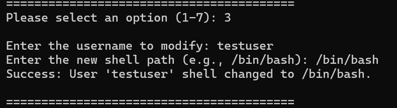
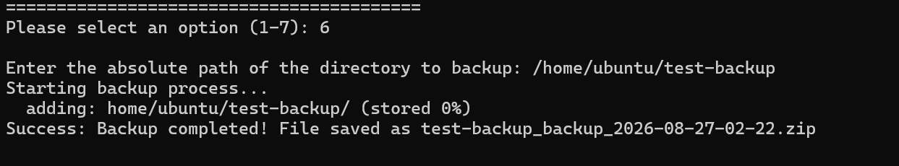
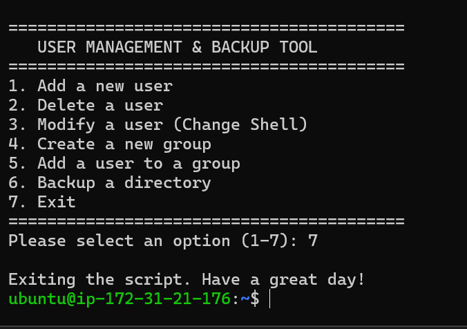
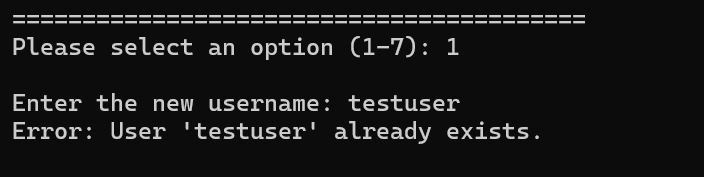

# Linux User Management & Backup Tool

A practical Bash scripting project designed to automate common Linux system administration tasks through an interactive, menu-driven command-line interface.

The tool provides functionality for managing Linux users and groups, modifying user shells, and creating compressed backups of directories.

---

## Features

- Add a new Linux user
- Delete an existing user and their home directory
- Modify a user's default shell
- Create a new Linux group
- Add a user to an existing group
- Create a ZIP backup of a directory
- Generate timestamped backup filenames
- Validate users, groups, and directory paths
- Handle basic errors and invalid input
- Interactive menu-driven interface

---

## Technologies Used

- Bash Shell Scripting
- Linux
- Git
- GitHub
- Linux System Administration Commands
- `useradd`
- `userdel`
- `usermod`
- `groupadd`
- `passwd`
- `zip`

---

## Project Structure

```text
linux-user-management-backup-tool/
│
├── README.md
├── user_management_backup_tool.sh
│
└── screenshots/
    ├── main-menu.png
    ├── add-user.png
    ├── delete-user.png
    ├── modify-user-shell.png
    ├── create-group.png
    ├── add-user-to-group.png
    ├── backup-success.png
    ├── error-user-exists.png
    └── exit-program.png
```

---

## Getting Started

### Clone the Repository

```bash
git clone git@github.com:muhammadshoaib7766/linux-user-management-backup-tool.git
```

### Navigate to the Project Directory

```bash
cd linux-user-management-backup-tool
```

### Give Execute Permission

```bash
chmod 774 user_management_backup_tool.sh
```

### Run the Script

```bash
./user_management_backup_tool.sh
```

> Some operations require administrator privileges. The script uses `sudo` for commands that modify users and groups.

---

## Main Menu

When the script is executed, the following interactive menu is displayed:

```text
=========================================
   USER MANAGEMENT & BACKUP TOOL
=========================================
1. Add a new user
2. Delete a user
3. Modify a user (Change Shell)
4. Create a new group
5. Add a user to a group
6. Backup a directory
7. Exit
=========================================
```


---

## Usage

### 1. Add a New User

Creates a new Linux user and automatically creates the user's home directory.

```text
Enter the new username: testuser
New password:
Retype new password:
Success: User 'testuser' has been added.
```


---

### 2. Delete a User

Deletes an existing Linux user along with the user's home directory.

```text
Enter the username to delete: testuser
Success: User 'testuser' and their home directory have been deleted.
```


---

### 3. Modify User Shell

Changes the default shell of an existing user.

```text
Enter the username to modify: testuser
Enter the new shell path: /bin/bash
Success: User 'testuser' shell changed to /bin/bash.
```



---

### 4. Create a New Group

Creates a new Linux group after checking whether the group already exists.

```text
Enter the new group name: developers
Success: Group 'developers' has been created.
```


---

### 5. Add a User to a Group

Adds an existing user to an existing Linux group.

```text
Enter the username: testuser
Enter the group name: developers
Success: User 'testuser' added to group 'developers'.
```


---

### 6. Backup a Directory

Creates a ZIP archive of a selected directory. The backup filename automatically includes the directory name and a timestamp.

Example:

```text
Enter the absolute path of the directory to backup:
/home/ubuntu/test-backup

Starting backup process...

Success: Backup completed!
```

Example backup filename:

```text
test-backup_backup_2026-08-27-02-22.zip
```



---

### 7. Exit

Safely exits the program.

```text
Please select an option (1-7): 7

Exiting the script. Have a great day!
```



---

## Error Handling

The script performs basic validation and handles common errors, including:

- User already exists
- User does not exist
- Group already exists
- User or group does not exist
- Invalid directory path
- Invalid menu option

Example:

```text
Error: User 'testuser' already exists.
```



---

## Requirements

- Linux operating system
- Bash shell
- `sudo` privileges
- `zip` utility

### Ubuntu / Debian

```bash
sudo apt install zip
```

### Fedora

```bash
sudo dnf install zip
```

### Arch Linux

```bash
sudo pacman -S zip
```

---

## Concepts Practiced

- Bash scripting
- Functions
- User input with `read`
- Conditional statements
- `if` and `else`
- `case` statements
- `while` loops
- Linux user management
- Linux group management
- User shell modification
- File and directory validation
- Backup automation
- Error handling
- Linux system administration
- Git and GitHub

---

## Future Improvements

- Colored terminal output
- Confirmation before deleting users
- Logging functionality
- Shell path validation
- Custom backup destination
- `.tar.gz` backup support
- User and group information display
- Required command checks
- Automatic cleanup of old backups

---

## Author

**Muhammad Shoaib**

GitHub: https://github.com/muhammadshoaib7766

---

## License

This project was created for educational and practical learning purposes.
