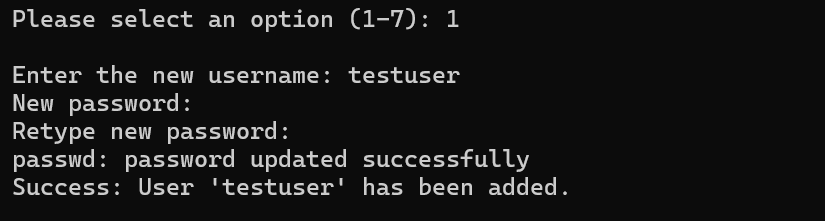
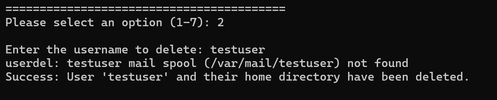
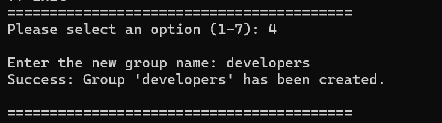
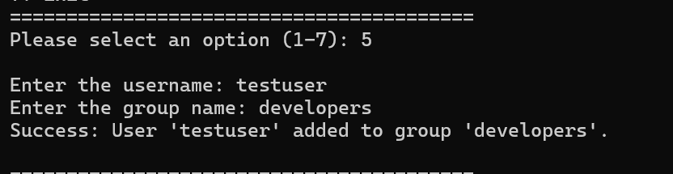

# Linux User Management & Backup Tool

A menu-driven Bash scripting project designed to automate basic Linux system administration tasks.

This tool allows users to manage Linux user accounts and groups, modify user shells, and create directory backups directly from the terminal.

---

## Features

- Add a new user
- Delete an existing user
- Change a user's default shell
- Create a new group
- Add a user to a group
- Backup a directory into a ZIP file
- Input validation and basic error handling
- Interactive menu-driven interface

---

## Technologies Used

- Bash Shell Scripting
- Linux System Administration Commands
- `useradd`
- `userdel`
- `usermod`
- `groupadd`
- `passwd`
- `zip`

---

## Project Structure

```text
linux-user-management-backup-tool/
│
├── user_management_backup.sh
├── README.md
│
└── screenshots/
    ├── main-menu.png
    ├── add-user.png
    ├── delete-user.png
    ├── modify-user.png
    ├── create-group.png
    ├── add-user-to-group.png
    ├── backup-directory.png
    └── error-handling.png
```

---

## Getting Started

### 1. Clone the Repository

```bash
git clone https://github.com/YOUR-USERNAME/linux-user-management-backup-tool.git
```

### 2. Navigate to the Project Directory

```bash
cd linux-user-management-backup-tool
```

### 3. Give Execute Permission

```bash
chmod +x user_management_backup.sh
```

### 4. Run the Script

```bash
./user_management_backup.sh
```

> **Note:** Some operations require administrator privileges. The script uses `sudo` for commands that modify users and groups.

---

# Main Menu

When the script is executed, the following interactive menu is displayed:

```text
=========================================
   USER MANAGEMENT & BACKUP TOOL
=========================================
1. Add a new user
2. Delete a user
3. Modify a user (Change Shell)
4. Create a new group
5. Add a user to a group
6. Backup a directory
7. Exit
=========================================
```

## Screenshot: Main Menu

<!-- Add screenshot here -->


---

# 1. Add a New User

This option creates a new Linux user.

The script checks whether the username already exists. If the user does not exist, a new account is created along with a home directory.

Example:

```text
Enter the new username: testuser
Success: User 'testuser' has been added.
```

## Screenshot: Adding a User

<!-- Add screenshot here -->



---

# 2. Delete a User

This option deletes an existing Linux user and removes their home directory.

Example:

```text
Enter the username to delete: testuser
Success: User 'testuser' and their home directory have been deleted.
```

## Screenshot: Deleting a User

<!-- Add screenshot here -->



---

# 3. Modify User Shell

This option allows the administrator to change the default shell of an existing user.

Example:

```text
Enter the username to modify: testuser
Enter the new shell path: /bin/bash
Success: User 'testuser' shell changed to /bin/bash.
```

## Screenshot: Changing User Shell

<!-- Add screenshot here -->


---

# 4. Create a New Group

This option creates a new Linux group.

The script checks whether the group already exists before creating it.

Example:

```text
Enter the new group name: developers
Success: Group 'developers' has been created.
```

## Screenshot: Creating a Group

<!-- Add screenshot here -->



---

# 5. Add a User to a Group

This option adds an existing user to an existing Linux group.

The script verifies that both the user and group exist before performing the operation.

Example:

```text
Enter the username: testuser
Enter the group name: developers
Success: User 'testuser' added to group 'developers'.
```

## Screenshot: Adding User to a Group

<!-- Add screenshot here -->



---

# 6. Backup a Directory

This feature creates a ZIP backup of a selected directory.

The user provides the absolute path of the directory. The backup file is automatically named using the directory name and timestamp.

Example:

```text
Enter the absolute path of the directory to backup:
/home/user/Documents

Starting backup process...

Success: Backup completed!
File saved as Documents_backup_2026-08-27-10-30.zip
```

## Screenshot: Directory Backup

<!-- Add screenshot here -->


---

# 7. Exit

Selecting option `7` safely exits the program.

Example:

```text
Please select an option (1-7): 7

Exiting the script. Have a great day!
```

---

# Error Handling

The script includes basic validation and error handling for common situations.

Examples include:

- User already exists
- User does not exist
- Group already exists
- Invalid directory path
- Invalid menu option

Example:

```text
Error: User 'testuser' already exists.
```

## Screenshot: Error Handling

<!-- Add screenshot here -->


---

# Requirements

To run this project, you need:

- A Linux operating system
- Bash shell
- `sudo` privileges
- `zip` utility

If `zip` is not installed, install it using the appropriate package manager.

### Ubuntu / Debian

```bash
sudo apt install zip
```

### Fedora

```bash
sudo dnf install zip
```

### Arch Linux

```bash
sudo pacman -S zip
```

---

# Concepts Practiced

This project demonstrates practical knowledge of:

- Bash scripting
- Functions
- Conditional statements
- `if` statements
- `case` statements
- `while` loops
- User input with `read`
- Linux user management
- Linux group management
- File and directory handling
- Backup automation
- Error handling
- Basic Linux system administration

---

# Future Improvements

Possible future improvements include:

- Add colored terminal output
- Add logging functionality
- Add confirmation before deleting users
- Add shell path validation
- Add backup destination selection
- Add `.tar.gz` backup support
- Display user information
- Display group members
- Add automatic backup cleanup

---

# Author

**Muhammad Shoaib**

GitHub: https://github.com/muhammadshoaib776

---

# License

This project was created for educational and practical learning purposes.

---

If you found this project useful, consider giving it a star!
